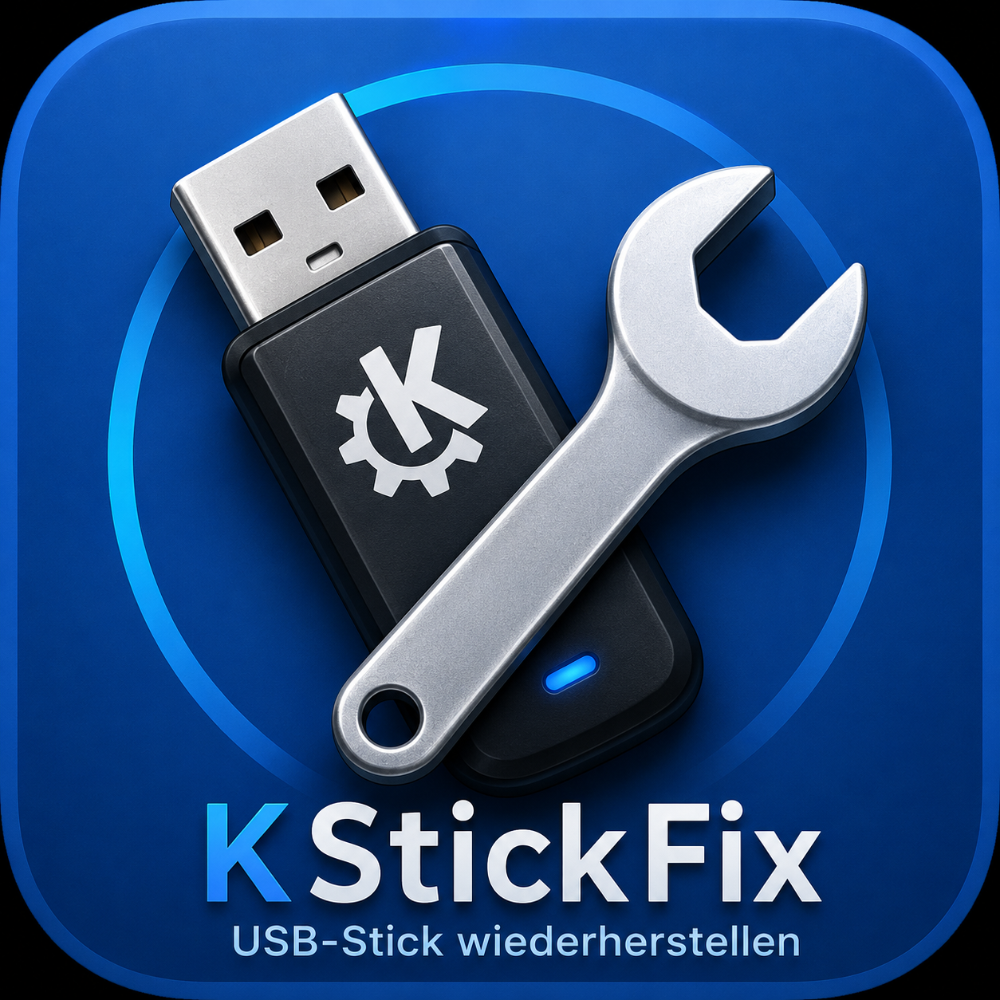

# KStickFix



KStickFix ist ein grafisches Werkzeug für Linux, mit dem sich USB-Sticks analysieren, wiederherstellen und für neue Einsatzzwecke vorbereiten lassen.

Das Ziel des Projekts war es, eine leicht verständliche Alternative zu verschiedenen Terminalbefehlen bereitzustellen. Viele Linux-Werkzeuge sind leistungsfähig, setzen aber Erfahrung voraus. KStickFix bündelt häufig benötigte Funktionen in einer übersichtlichen Oberfläche.

## Funktionen

- USB-Sticks erkennen
- USB-Sticks analysieren
- beschädigte oder ungewöhnliche USB-Sticks wiederherstellen
- exFAT, FAT32, NTFS und ext4
- MBR und GPT
- ISO-Dateien auf USB-Sticks schreiben
- Diagnosebericht
- Systemprüfung

## Unterstützte Systeme

Entwickelt und getestet unter openSUSE Tumbleweed.

KStickFix sollte grundsätzlich auch unter anderen Linux-Distributionen funktionieren, sofern die benötigten Systemwerkzeuge installiert sind.

## Benötigte Pakete unter openSUSE

```bash
sudo zypper install python3 python3-pyside6 util-linux parted exfatprogs dosfstools ntfs-3g e2fsprogs udisks2 polkit
```

## Starten

```bash
python3 src/main.py
```

Oder:

```bash
./start.sh
```

## Installation ins KDE-Menü

```bash
./INSTALLIEREN.sh
```

Danach erscheint KStickFix im KDE-Anwendungsmenü.

## Sicherheit

KStickFix löscht niemals automatisch Daten. Vor gefährlichen Aktionen erscheinen Sicherheitsabfragen.

Trotzdem gilt: Vor dem Testen nur USB-Sticks verwenden, auf denen keine wichtigen Daten liegen.

## Projektstatus

Mit Version 1.0.1 gilt KStickFix als abgeschlossen.

Der ursprüngliche Autor plant derzeit keine weitere aktive Entwicklung.

Das Projekt bleibt öffentlich verfügbar und darf entsprechend der Lizenz verwendet, verändert und weiterentwickelt werden.

Fehlerberichte und Verbesserungsvorschläge sind willkommen. Sollte sich jemand finden, der KStickFix dauerhaft pflegen möchte, kann das Projekt gerne übernommen und weitergeführt werden.

## Autor

Christian Wolf  
E-Mail: christianwolf5@gmx.net

Entwicklungspartner und technische Unterstützung: OpenAI ChatGPT

Erstellt als privates Open-Source-Projekt für die Linux-Community.

## Lizenz

MIT License
